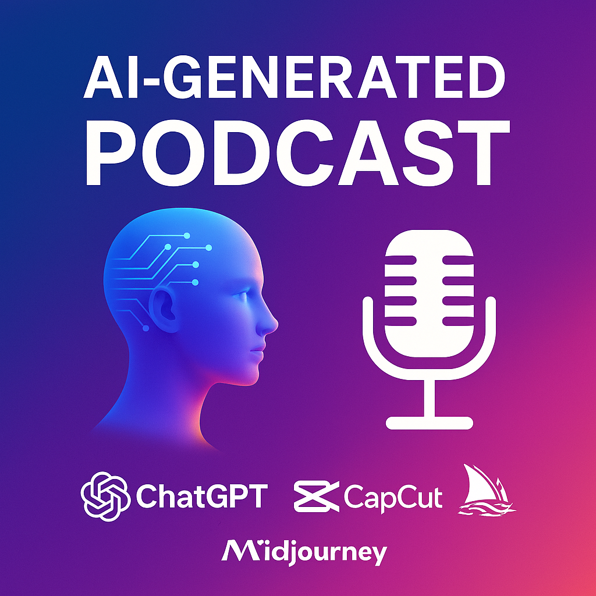

<a href="https://dio.me/">
    

-------

# 🎙️ Projeto Podcast Gerado por I.A.s

ℹ️ **NOTA:** Este é o repositório desenvolvido durante o curso no qual fui aluno na plataforma da [DIO](https://dio.me)

Este projeto tem como objetivo demonstrar como é possível **gerar um podcast completo utilizando ferramentas de Inteligência Artificial**, por meio de uma esteira de prompts bem estruturada para cada etapa do processo criativo.

<a href="https://soundcloud.com/marcus-435582933/vetor-etico-o-codigo-da-consciencia" title="Enter SOUNDCLOUD now">📕 Clique aqui para ouvir</a>

## 🧠 Visão Geral

Utilizamos uma sequência de prompts para gerar:

- Roteiro
- Narração em áudio
- Imagem de capa
- Edição final com trilha sonora

Tudo isso feito com ferramentas de IA e edição acessíveis.

## 💻 Tecnologias Utilizadas

- **ChatGPTG** – geração de roteiro e estrutura narrativa [ChatGPT](https://www.chatgpt.com/) 
- **Gemini** – revisão de roteiro e estrutura narrativa e revisão final da imagem [Gemini](https://gemini.google.com/) 
- **MidJourney** – criação das imagens de capa [MidJourney](https://www.midjourney.com/app/)
- **ElevenLabs** – geração de voz realista em português [ElevenLabs](https://beta.elevenlabs.io/)
- **CapCut** – edição de áudio e inserção de trilhas sonoras [Capcut](https://www.capcut.com/pt-br/)

## ✨ Como Foi Feito?

1. **Roteiro** gerado via ChatGPT com prompts específicos, com revisão via Gemini.
2. **Áudio** narrado com voz sintética usando ElevenLabs.
3. **Imagem de capa** criada com MidJourney, revisada no Gemini (Nano Banana).
4. **Edição final** feita no CapCut, com ajustes de áudio e trilha sonora.

## 📚 Materiais

- 🔗 Link da live no YouTube [Link da live no Youtube](https://www.youtube.com)
- 📄 Template no Notion com os prompts utilizados [Notion Template](https://helpful-jump-17b.notion.site/PAS-Podcast-AI-Studio-210489e15d7a4a73b743bb159e45d06f?pvs=4)
- 🎧 Editor de áudio recomendado [Editor de aúdio](https://www.capcut.com/editor?from_page=landing_page&__action_from=picture_V%C3%ADdeos%20profissionais%20em%20minutos,%20n%C3%A3o%20em%20horas.)

## 🛠️ Instruções de Execução

Para criar seu próprio episódio de podcast com IA, siga os passos abaixo utilizando os materiais disponíveis:

1. 🤖 Use os **prompts de roteiro** no ChatGPT (revisado no Gemini).
2. 🎙️ Gere o **áudio** com ElevenLabs usando o roteiro criado.
3. 🎨 Crie a **imagem de capa** com os prompts no MidJourney e revisão no Nano Banana do Gemini.
4. 🎧 Edite o áudio no CapCut, adicionando trilha sonora e finalizando o episódio.

## 👨‍💻 Expert

**Marcus Vasconcellos ** [Linkedin](https://www.linkedin.com/in/marcusvasconcellos) 
  
---
